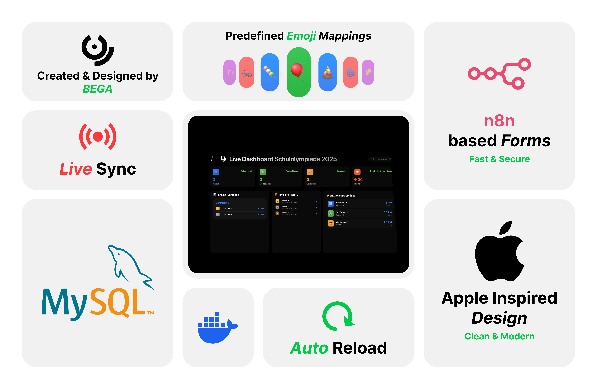

# Schulolympiade Dashboard

> ✨ **Neu**: Das System wurde vollständig refactoriert und ist jetzt einfach mit Docker deploybar! Siehe [DOCKER_SETUP.md](DOCKER_SETUP.md) für detaillierte Anweisungen.

---



Dieses Projekt ist ein vollständiges Dashboard- und Verwaltungssystem für eine Schulolympiade. Es besteht aus mehreren Services (Microservices), die alle auf eine zentrale MySQL-Datenbank zugreifen. Die Verwaltung und das Monitoring erfolgen über moderne Web-Oberflächen. Das System ist für Docker optimiert und kann einfach auf einem Server oder im lokalen Netzwerk betrieben werden.

---

## Quick Start mit Docker

```bash
# Repository klonen
git clone https://github.com/bega-berlin/Schulolympiade-2025.git
cd Schulolympiade-2025

# Umgebungsvariablen konfigurieren
cp .env.example .env
# Bearbeite .env und ändere Passwörter!

# Services starten
docker-compose up -d --build

# Status prüfen
docker-compose ps

# Dashboard öffnen
# http://localhost:3000
```

Siehe [DOCKER_SETUP.md](DOCKER_SETUP.md) für vollständige Anweisungen.

---

## Inhaltsverzeichnis

- [Features](#features)
- [Quick Start](#quick-start-mit-docker)
- [Projektstruktur](#projektstruktur)
- [Services & Komponenten](#services--komponenten)
- [Konfiguration](#konfiguration)
- [Docker & Backups](#docker--backups)
- [Sicherheit](#sicherheit)
- [Nützliche Kommandos](#nützliche-kommandos)
- [Erweiterungsideen](#erweiterungsideen)
- [Lizenz](#lizenz)

---

## Features

- **Live-Dashboard** mit Ranglisten, Statistiken und aktuellen Ergebnissen
- **Admin-Panel** zum Bearbeiten aller Ergebnisse (mit Login)
- **Emoji-Mapping-Editor** für Disziplin-Icons (mit Login)
- **Automatische Datenbank-Backups** (Docker-basiert)
- **IP-Logging** für bestimmte Aktionen
- **REST-API** für Frontend und externe Tools
- **Vollständig containerisiert** mit Docker & Docker Compose
- **Umgebungsvariablen** für einfache Konfiguration
- **Zentralisiertes Logging** für alle Services
- **Health Checks** für alle Services
- **phpMyAdmin & CloudBeaver** für DB-Management

---

## Projektstruktur

```
schulolympiade-2025/
│
├── dashboard/                # Haupt-Dashboard (Frontend & Backend)
│   ├── public/               # Statische Dateien (HTML, JS, CSS)
│   └── server.js             # Express-Server für das Dashboard
│
├── edit-data-dashboard/      # Admin-Panel für Ergebnisse
│   ├── index.html, script.js, style.css
│   └── server.js
│
├── edit-emoji-dashboard/     # Admin-Panel für Emoji-Mappings
│   ├── index.html, script.js, style.css
│   └── server.js
│
├── success-emoji/            # Erfolgsseite für Emoji-Eintrag
│   ├── public/
│   └── server.js
│
├── success-event/            # Erfolgsseite für Event-Eintrag
│   ├── public/
│   └── server.js
│
├── ip-logging/               # IP-Logging-Service
│   └── server.js
│
├── shared/                   # Gemeinsame Module
│   ├── config.js             # Zentrale Konfiguration
│   ├── db.js                 # Datenbankverbindung
│   ├── logger.js             # Logging-Utility
│   └── middleware.js         # Express Middleware
│
├── docker/                   # Docker-Daten
│   ├── mysql-backups/        # Backup-Ordner (wird automatisch befüllt)
│   └── mysql-init/           # SQL-Init-Skripte
│
├── Dockerfile                # Docker Image Definition
├── docker-compose.yml        # Service Orchestrierung
├── .env.example              # Umgebungsvariablen Template
├── DOCKER_SETUP.md           # Detaillierte Docker-Anleitung
└── README.md                 # Diese Datei
```

---

## Services & Komponenten

### 1. Dashboard (`dashboard/`)
- **Frontend:** Zeigt Ranglisten, Statistiken, Disziplinen und aktuelle Ergebnisse.
- **Backend:** Express.js-Server, REST-API (`/api/stats`, `/api/leaderboard`, `/api/disciplines`, `/api/recent`, `/api/emoji-map`).
- **IP-Logging:** Jeder API-Zugriff wird mit IP, Zeit und User-Agent geloggt.

### 2. Edit Data Dashboard (`edit-data-dashboard/`)
- **Admin-Panel:** Ergebnisse ansehen, bearbeiten, löschen, hinzufügen.
- **Login:** SHA256-Hash, Token-basiert.
- **API:** `/api/login`, `/data/results.json`, `/api/save` (nur mit Token).

### 3. Edit Emoji Dashboard (`edit-emoji-dashboard/`)
- **Admin-Panel:** Emoji-Trigger für Disziplinen verwalten.
- **Login:** Wie oben.
- **API:** `/api/login`, `/data/emojiMap.json`, `/api/save` (nur mit Token).

### 4. Success-Seiten (`success-emoji/`, `success-event/`)
- **Frontend:** Zeigt nach erfolgreichem Eintrag eine Bestätigungsseite.
- **Backend:** Statischer Express-Server.

### 5. IP-Logging (`ip-logging/`)
- **Backend:** HTTP-Server, der IP-Adressen und Zeitstempel in eine Datei schreibt und weiterleitet.

### 6. Gemeinsame Module (`shared/`)
- **config.js:** Zentrale Konfiguration aus Umgebungsvariablen
- **db.js:** MySQL Connection Pool mit Retry-Logik
- **logger.js:** Zentralisiertes Logging für alle Services
- **middleware.js:** Wiederverwendbare Express Middleware (CORS, Auth, Logging, Fehlerbehandlung)

---

## Konfiguration

Das System wird vollständig über Umgebungsvariablen konfiguriert. Kopiere `.env.example` zu `.env` und passe die Werte an:

```bash
cp .env.example .env
```

Wichtige Einstellungen:

- **Database**: `DB_HOST`, `DB_PORT`, `DB_USER`, `DB_PASSWORD`, `DB_NAME`
- **Ports**: `DASHBOARD_PORT`, `EDIT_DATA_PORT`, etc.
- **Admin**: `ADMIN_USERNAME`, `ADMIN_PASSWORD` (⚠️ Ändern!)
- **Backups**: `BACKUP_CRON_TIME`, `BACKUP_MAX_COUNT`

Siehe [DOCKER_SETUP.md](DOCKER_SETUP.md) für Details.

---

## Datenbank

- **MySQL 8** (Docker)
- **Tabellen:** `results`, `emoji_mappings`
- **User:** Konfigurierbar via `.env`
- **Init-Skripte:** Im Ordner `docker/mysql-init/`

---

## Docker & Backups

### Schnellstart

```bash
# Services starten
docker-compose up -d

# Status prüfen
docker-compose ps

# Logs anzeigen
docker-compose logs -f

# Services stoppen
docker-compose down
```

### Backups

Automatische Backups werden alle 10 Minuten erstellt (konfigurierbar):
- **Speicherort:** `docker/mysql-backups/`
- **Anzahl:** Letzten 10 Backups (konfigurierbar)

Manuelles Backup:
```bash
docker exec schulolympiade_mysql mysqldump -u olympiade_user -polympiade2025 schulolympiade > backup.sql
```

Siehe [DOCKER_SETUP.md](DOCKER_SETUP.md) für weitere Details.

---

## Sicherheit

⚠️ **Wichtig:** Ändern Sie alle Standard-Passwörter in der `.env` Datei!

- **Admin-Panels:** Login mit Benutzername & Passwort, Token-basiert
- **Datenbank:** Kein Root-Zugriff von außen, nur dedizierter User
- **Backups:** Werden im Host-Ordner gespeichert
- **CORS:** Konfigurierbar über Umgebungsvariablen
- **Input-Validierung:** Alle Eingaben werden validiert
- **Error Handling:** Sichere Fehlerbehandlung ohne Offenlegung sensibler Daten

Siehe [DOCKER_SETUP.md](DOCKER_SETUP.md) für Security Best Practices.

---

## Nützliche Kommandos

**Container verwalten:**
```bash
docker-compose up -d           # Starten
docker-compose down            # Stoppen
docker-compose restart         # Neustarten
docker-compose ps              # Status prüfen
```

**Logs:**
```bash
docker-compose logs -f         # Alle Logs
docker-compose logs dashboard  # Specific service
```

**Datenbank:**
```bash
# In MySQL Shell
docker exec -it schulolympiade_mysql mysql -u olympiade_user -polympiade2025 schulolympiade

# Backup erstellen
docker exec schulolympiade_mysql mysqldump -u olympiade_user -p schulolympiade > backup.sql
```

**Nach Code-Änderungen:**
```bash
docker-compose down
docker-compose up -d --build
```

Vollständige Liste in [DOCKER_SETUP.md](DOCKER_SETUP.md).

---

## Erweiterungsideen

- **Live-Updates** (WebSockets) für das Dashboard
- **Benutzer- und Rechteverwaltung** für mehrere Admins
- **Import/Export** von Ergebnissen (CSV, Excel)
- **Mehrsprachigkeit** (DE/EN)
- **Erweiterte Statistiken** (Diagramme, Trends)
- **E-Mail-Benachrichtigungen** bei neuen Ergebnissen
- **Mobile-Optimierung** für alle Dashboards

---

## Lizenz
Copyright (c) 2025 BEGA Team (Otto-Nagel-Gymnasium)

Diese Software darf ohne ausdrückliche, schriftliche Genehmigung des Autors nicht verwendet, kopiert, verändert, verbreitet oder weitergegeben werden.

Die Nutzung dieser Software für kommerzielle Zwecke oder zur Gewinnerzielung – direkt oder indirekt – ist ausdrücklich untersagt.

Die Software wird "wie sie ist" bereitgestellt, ohne jegliche ausdrückliche oder implizite Garantie. Der Autor haftet nicht für Schäden, die durch die Nutzung der Software entstehen. Es besteht keine Verpflichtung zur Wartung, Fehlerbehebung oder Unterstützung.

Durch das Herunterladen, Kopieren oder Verwenden der Software erklären Sie sich mit diesen Bedingungen einverstanden.
