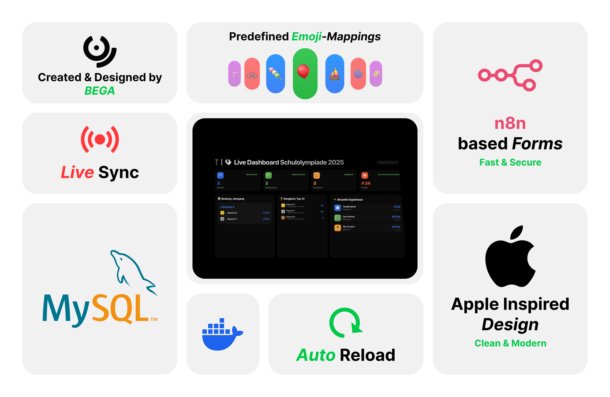

# Schulolympiade Dashboard



Dieses Projekt ist ein vollständiges Dashboard- und Verwaltungssystem für eine Schulolympiade. Es besteht aus mehreren Services (Microservices), die alle auf eine zentrale MySQL-Datenbank zugreifen. Die Verwaltung und das Monitoring erfolgen über moderne Web-Oberflächen. Das System ist für Docker optimiert und kann einfach auf einem Server oder im lokalen Netzwerk betrieben werden.

---

## Inhaltsverzeichnis

- [Features](#features)
- [Projektstruktur](#projektstruktur)
- [Services & Komponenten](#services--komponenten)
- [Datenbank](#datenbank)
- [Docker & Backups](#docker--backups)
- [Sicherheit](#sicherheit)
- [Nützliche Kommandos](#nützliche-kommandos)
- [Erweiterungsideen](#erweiterungsideen)
- [Lizenz](#lizenz)

---

## Features

- **Live-Dashboard** mit Ranglisten, Statistiken und aktuellen Ergebnissen
- **Admin-Panel** zum Bearbeiten aller Ergebnisse (mit Login)
- **Emoji-Mapping-Editor** für Disziplin-Icons (mit Login)
- **Automatische Datenbank-Backups** (Docker-basiert)
- **IP-Logging** für bestimmte Aktionen
- **REST-API** für Frontend und externe Tools
- **Docker-Compose** für einfachen Betrieb
- **phpMyAdmin & CloudBeaver** für DB-Management

---

## Projektstruktur

```
schulolympiade-mysql/
│
├── dashboard/                # Haupt-Dashboard (Frontend & Backend)
│   ├── public/               # Statische Dateien (HTML, JS, CSS)
│   └── server.js             # Express-Server für das Dashboard
│
├── edit-data-dashboard/      # Admin-Panel für Ergebnisse
│   ├── index.html, script.js, style.css
│   └── server.js
│
├── edit-emoji-dashboard/     # Admin-Panel für Emoji-Mappings
│   ├── index.html, script.js, style.css
│   └── server.js
│
├── success-emoji/            # Erfolgsseite für Emoji-Eintrag
│   ├── public/
│   └── server.js
│
├── success-event/            # Erfolgsseite für Event-Eintrag
│   ├── public/
│   └── server.js
│
├── ip-logging/               # IP-Logging-Service
│   └── server.js
│
├── shared/                   # Gemeinsame Module (z.B. DB)
│   └── db.js
│
├── docker/                   # Docker-Setup
│   ├── docker-compose.yaml
│   ├── mysql-backups/        # Backup-Ordner (wird automatisch befüllt)
│   └── mysql-init/           # SQL-Init-Skripte
│
├── docker-nginx/             # Reverse Proxy (optional)
│   └── docker-compose.yaml
│
├── docker-n8n/               # Automatisierung (optional)
│   └── n8n-compose.yaml
│
└── README.md                 # Diese Datei
```

---

## Services & Komponenten

### 1. Dashboard (`dashboard/`)
- **Frontend:** Zeigt Ranglisten, Statistiken, Disziplinen und aktuelle Ergebnisse.
- **Backend:** Express.js-Server, REST-API (`/api/stats`, `/api/leaderboard`, `/api/disciplines`, `/api/recent`, `/api/emoji-map`).
- **IP-Logging:** Jeder API-Zugriff wird mit IP, Zeit und User-Agent geloggt.

### 2. Edit Data Dashboard (`edit-data-dashboard/`)
- **Admin-Panel:** Ergebnisse ansehen, bearbeiten, löschen, hinzufügen.
- **Login:** SHA256-Hash, Token-basiert.
- **API:** `/api/login`, `/data/results.json`, `/api/save` (nur mit Token).

### 3. Edit Emoji Dashboard (`edit-emoji-dashboard/`)
- **Admin-Panel:** Emoji-Trigger für Disziplinen verwalten.
- **Login:** Wie oben.
- **API:** `/api/login`, `/data/emojiMap.json`, `/api/save` (nur mit Token).

### 4. Success-Seiten (`success-emoji/`, `success-event/`)
- **Frontend:** Zeigt nach erfolgreichem Eintrag eine Bestätigungsseite.
- **Backend:** Statischer Express-Server.

### 5. IP-Logging (`ip-logging/`)
- **Backend:** HTTP-Server, der IP-Adressen und Zeitstempel in eine Datei schreibt und weiterleitet.

### 6. Gemeinsame Datenbankanbindung (`shared/db.js`)
- **MySQL Connection Pool** für alle Services.
- **Testfunktion** für DB-Verbindung.

---

## Datenbank

- **MySQL 8** (Docker)
- **Tabellen:** `results`, `emoji_mappings` (und ggf. weitere)
- **User:** `olympiade_user`
- **Passwort:** Siehe `.env` oder `docker-compose.yaml`
- **Init-Skripte:** Im Ordner `docker/mysql-init/` (werden beim ersten Start ausgeführt)

---

## Docker & Backups

### Starten aller Services

```bash
cd docker
docker compose up -d
```

### Datenbank-Backups

- **Automatisch:** Das Service `mysql_backup` (Image: `fradelg/mysql-cron-backup`) erstellt alle 10 Minuten ein Backup der Datenbank im Ordner `docker/mysql-backups/`.
- **Backup-Intervalle:** Über die Umgebungsvariable `CRON_TIME` einstellbar.
- **Backup-Ordner:** `docker/mysql-backups/` (auf dem Host, einfach kopierbar)
- **Maximale Backups:** Über `MAX_BACKUPS` einstellbar.

### Datenbank-Management

- **phpMyAdmin:** [http://192.168.100.73:8080](http://192.168.100.73:8080)
- **CloudBeaver:** [http://localhost:8081](http://localhost:8081)

---

## Sicherheit

- **Admin-Panels:** Login mit Benutzername & Passwort, Token-basiert (kein OAuth).
- **Datenbank:** Kein Root-Zugriff von außen, nur dedizierter User.
- **Backups:** Werden im Host-Ordner gespeichert, Zugriff nur für berechtigte Nutzer.
- **CORS:** Nur lokale Zugriffe erlaubt (anpassbar in `server.js`).

---

## Nützliche Kommandos

**Alle Container starten/stoppen:**
```bash
docker compose up -d
docker compose down
```

**Logs anzeigen:**
```bash
docker compose logs -f
```

**Backup manuell auslesen:**
```bash
ls docker/mysql-backups/
```

**In die Datenbank einloggen:**
```bash
docker exec -it schulolympiade_mysql mysql -uolympiade_user -polympiade2025 schulolympiade
```

---

## Erweiterungsideen

- **Live-Updates** (WebSockets) für das Dashboard
- **Benutzer- und Rechteverwaltung** für mehrere Admins
- **Import/Export** von Ergebnissen (CSV, Excel)
- **Mehrsprachigkeit** (DE/EN)
- **Erweiterte Statistiken** (Diagramme, Trends)
- **E-Mail-Benachrichtigungen** bei neuen Ergebnissen
- **Mobile-Optimierung** für alle Dashboards

---

## Lizenz

Dieses Projekt ist für schulische Zwecke gedacht. Für andere Einsatzzwecke bitte an den Autor wenden.